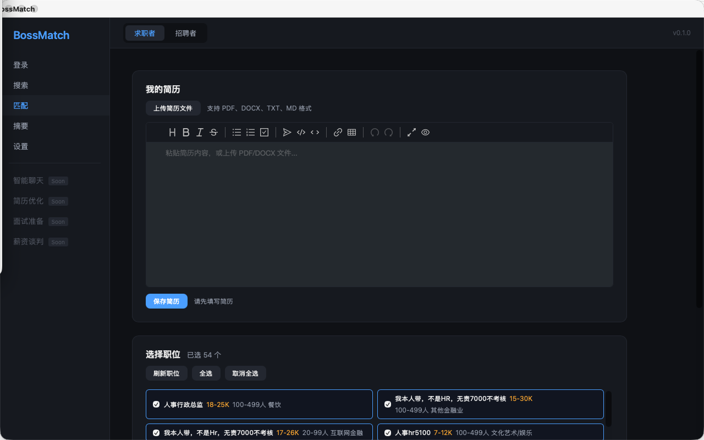
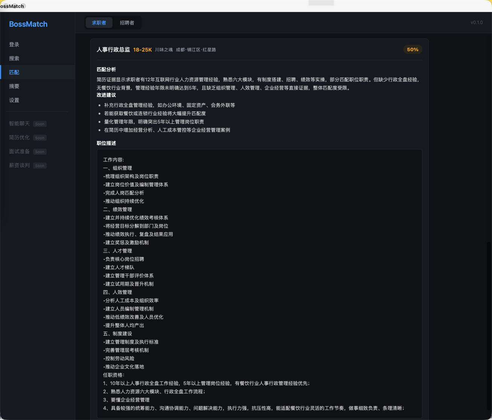
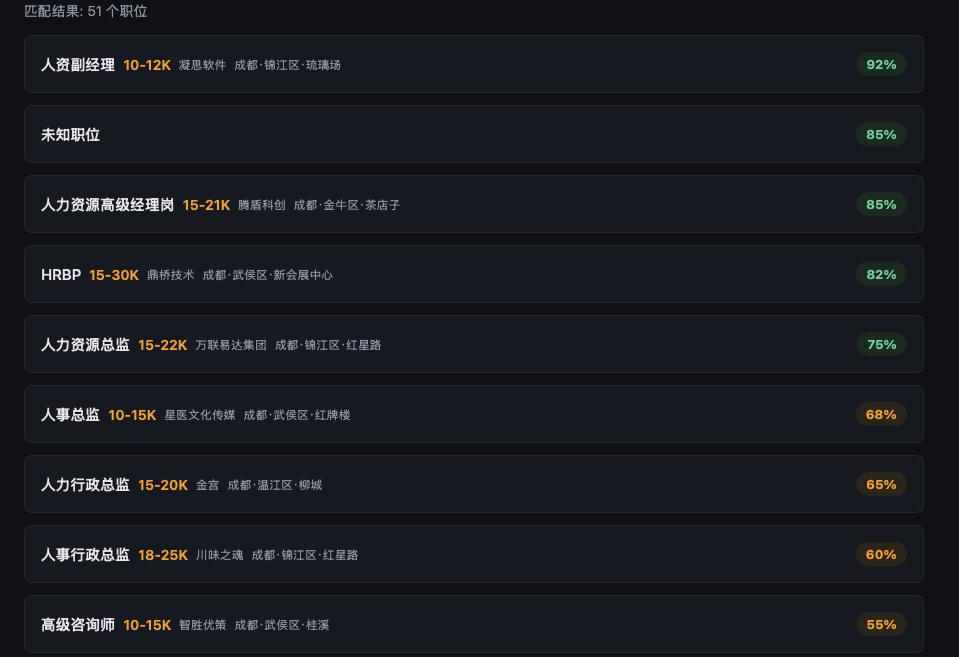

# BossMatch — AI 驱动的 BOSS直聘双向匹配桌面应用


BossMatch 是一款 AI 驱动的求职匹配桌面应用，基于 Chrome CDP 抓取 BOSS直聘职位，再通过 **RAG 智能匹配** 为你找到最合适的岗位。上传简历后，本地嵌入模型 + 向量检索 + LLM 对每个岗位输出匹配评分、证据引用、差距分析和优化建议，并生成综合求职摘要。



---

## ⚠️ 免责声明

本项目仅供个人学习和求职研究使用，旨在帮助求职者高效匹配岗位、理解自身差距并优化求职策略。请勿用于任何违反 [BOSS直聘用户协议](https://www.zhipin.com/about/protocol.html) 或相关法律法规的用途，不得用于商业转售、恶意爬取或对目标网站造成负担的行为。使用本项目所产生的一切后果由使用者自行承担，作者不对任何滥用行为负责。

---

## ✨ 核心特性

- **Chrome CDP 抓取** — 复用真实浏览器登录态，调用搜索 API 获取明文薪资
- **RAG 智能匹配** — 简历与 JD 语义分块 → 本地嵌入向量化 → ChromaDB 检索 → LLM 打分+建议
- **三阶段流水线** — 模型初始化 → 索引构建 → 逐岗评分，实时进度推送
- **流式综合摘要** — 全部岗位评分后，LLM 流式输出结构化求职分析报告
- **简历文件解析** — 支持 PDF / DOCX / TXT / MD 上传，自动提取文本
- **补充材料增强** — 上传面试经验、目标公司资料等，作为额外匹配依据
- **双身份模式** — 求职者 (Geek) / 招聘者 (Boss) 切换，独立 Chrome Profile 与 CDP 端口
- **增量抓取** — 每页/每条详情立即写入 SQLite，异常退出不丢数据；已有详情自动跳过
- **多维筛选** — 薪资、经验、学历、公司规模、融资阶段、行业
- **全国城市** — 300+ 城市码表，运行时自动同步 BOSS 最新城市数据
- **PyWebView 桌面应用** — 原生窗口 + 前端 UI，非 Electron 轻量方案

<details>
<summary>🔍 为什么不用 Selenium / Playwright？</summary>

Selenium/Playwright 会启动完整的受控浏览器，体积大、指纹明显，容易触发 BOSS 的风控和验证码。BossMatch 直接连接你已经登录的真实 Chrome（CDP），复用真实指纹和登录态，调用页面内合法的搜索 API，返回的 `salaryDesc` 本就是明文。比传统 DOM 抓取更稳定，也更难被识别为自动化流量。

</details>

---

## 🚀 快速开始

### 安装

```bash
git clone git@github.com:LouXiaXiaoHei/boss-match.git
cd boss-match
pip install -r requirements.txt          # 最小依赖（CLI 模式）
pip install -e .                          # 完整安装（桌面应用 + CLI）
```

### 启动应用

```bash
python3 src/app.py
# 或安装后使用入口命令
pip install -e .
bossmatch
```

### 使用流程

1. **登录** — 在应用中点击「启动 Chrome」，在弹出的专用浏览器中登录 BOSS直聘
2. **搜索** — 输入关键词和城市，选择筛选条件，开始抓取职位
3. **匹配** — 上传简历，选择已抓取的职位，启动 AI 匹配
4. **查看** — 查看每个岗位的匹配评分、证据引用、差距分析和优化建议



### CLI 模式

不想启动桌面应用，也可以直接用命令行抓取和分析：

```bash
# 启动隔离 Chrome 并登录
python3 scripts/boss_cdp_raw.py --setup-chrome

# 抓取职位
python3 scripts/boss_cdp_raw.py --keyword "AI Agent" --city 上海 --pages 3 --analysis

# 生成聚合摘要
python3 scripts/job_summary.py --top  --top 15

# 查看支持的城市
python3 scripts/boss_cdp_raw.py --list-cities 江
```

---

## 📸 应用截图

### 登录管理

启动专用 Chrome 浏览器，登录 BOSS直聘。应用自动检测登录状态，嵌入模型在后台下载就绪。

### RAG 匹配

上传简历 → 选择职位 → 三阶段匹配流水线实时推进。每个岗位输出评分、证据、差距和优化建议。


### 匹配摘要

全部岗位评分完成后，LLM 流式输出结构化分析报告，包含整体匹配趋势、技能差距总结和求职优化方向。



---

## 🏗️ 架构

```
┌──────────────────────────────────────────────────────┐
│                    BossMatch App                      │
│                  (PyWebView Desktop)                  │
├──────────┬──────────┬──────────┬──────────┬──────────┤
│  登录页   │  搜索页   │  匹配页   │  摘要页   │  设置页   │
│  Login   │  Search  │  Match   │  Summary │ Settings │
└────┬─────┴────┬─────┴────┬─────┴────┬─────┴────┬─────┘
     │          │          │          │          │
     ▼          ▼          ▼          ▼          ▼
┌──────────────────────────────────────────────────────┐
│                   AppAPI (Bridge)                     │
│              JS ↔ Python API 桥接层                    │
├─────────┬──────────────────┬─────────────────────────┤
│ Chrome  │    GeekAPI       │      Matcher            │
│ Manager │  (Scrape Orch.)  │   (RAG Orchestrator)    │
├─────────┼──────────────────┼──────┬──────┬───────────┤
│  CDP    │   Scraper        │Embed │Vector│   LLM     │
│ Session │  (List+Detail)   │der   │Store │  Client   │
├─────────┼──────────────────┼──────┼──────┼───────────┤
│Profile  │  City/Constants  │Chunker│Retriever│Prompts │
│Manager  │  ResumeParser    │EventBus│Summarizer│      │
└─────────┴──────────────────┴──────┴──────┴───────────┘
                      │
                ┌─────┴─────┐
                │  SQLite   │
                │ Database  │
                └───────────┘
```

### RAG 匹配流水线

```
简历 + JD + 补充材料
        │
        ▼
   ┌─────────┐     Phase 0
   │ Chunker │ ────────────── 模型初始化
   └────┬────┘
        │ 语义分块
        ▼
   ┌──────────┐    Phase 1
   │ Embedder │ ────────────── 索引构建
   │(bge-small│
   │  -zh)    │
   └────┬─────┘
        │ 向量化 → ChromaDB
        ▼
   ┌──────────┐    Phase 2
   │ Retriever│ ────────────── 逐岗评分
   │ + LLM    │
   └────┬─────┘
        │ 评分 + 证据 + 建议
        ▼
   ┌──────────┐    Phase 3
   │Summarizer│ ────────────── 综合摘要
   │ (Stream) │
   └──────────┘
```

---

## 📁 项目结构

```
boss-match/
├── src/
│   ├── app.py                    # PyWebView 应用入口
│   ├── api/
│   │   ├── bridge.py             # JS ↔ Python API 桥接层
│   │   └── geek_api.py           # 求职者搜索/抓取编排
│   ├── ai/
│   │   ├── matcher.py            # RAG 匹配三阶段编排器
│   │   ├── embedder.py           # 本地嵌入模型 (bge-small-zh)
│   │   ├── chunker.py            # 简历/JD 语义分块
│   │   ├── vector_store.py       # ChromaDB 向量存储
│   │   ├── retriever.py          # 向量检索 + 上下文拼接
│   │   ├── client.py             # OpenAI 兼容 LLM 客户端
│   │   ├── summarizer.py         # 流式综合摘要生成
│   │   ├── prompts.py            # Prompt 模板
│   │   └── event_bus.py          # 匹配事件总线
│   ├── core/
│   │   ├── cdp.py                # Chrome DevTools Protocol 会话
│   │   ├── chrome.py             # Chrome 启停 + CDP 连接
│   │   ├── scraper.py            # 列表 + 详情页抓取
│   │   ├── detail.py             # 详情页 JD 提取
│   │   ├── city.py               # 城市码解析 (300+ 城市)
│   │   ├── constants.py          # 筛选参数映射 + 常量
│   │   ├── login.py              # 登录态探测
│   │   ├── js_templates.py       # CDP 注入 JS 模板
│   │   └── resume_parser.py      # 简历文件解析 (PDF/DOCX/TXT/MD)
│   ├── db/
│   │   ├── database.py           # SQLite Schema + 连接管理
│   │   └── repository.py         # 数据访问层
│   └── identity/
│       └── profile_manager.py    # 双身份 Chrome Profile 管理
├── frontend/
│   ├── index.html                # 单页应用入口
│   ├── css/style.css             # 全局样式
│   └── js/
│       ├── api.js                # 后端 API 调用封装
│       └── app.js                # 前端路由 + 页面渲染 + 状态管理
├── scripts/
│   ├── boss_cdp_raw.py           # CLI 抓取主脚本
│   └── job_summary.py            # 抓取后聚合摘要
├── data/
│   └── city_codes.json           # 全国城市码表
├── pics/                         # README 截图
├── pyproject.toml                # 项目元数据 + 依赖
└── requirements.txt              # 最小 CLI 依赖
```

---

## 🔧 技术栈

| 层级 | 技术 |
|------|------|
| 桌面框架 | PyWebView 5.x |
| 前端 | 原生 HTML/CSS/JS + Vditor (Markdown 编辑器) |
| 后端 | Python 3.10+ |
| 数据库 | SQLite |
| 嵌入模型 | BAAI/bge-small-zh-v1.5 (sentence-transformers) |
| 向量数据库 | ChromaDB |
| LLM | OpenAI 兼容 API (gpt-4o / 任意兼容模型) |
| 浏览器自动化 | Chrome DevTools Protocol (websocket-client) |
| 简历解析 | pypdf + python-docx |

---

## 📖 核心功能

### 登录管理

- 启动/关闭专用 Chrome 浏览器（独立 Profile，不影响主浏览器）
- 自动检测登录状态（带 30 分钟缓存 TTL）
- 嵌入模型后台下载，进度实时显示
- 求职者/招聘者双身份切换

### 职位搜索

- 关键词 + 城市 + 多维筛选（薪资/经验/学历/规模/融资/行业）
- 城市自动补全（300+ 城市，支持中文搜索）
- 后台线程抓取，实时进度推送（列表 → 详情）
- 增量保存：每页列表、每条详情立即写入 SQLite
- 已有详情自动跳过，避免重复抓取
- 点击职位卡片查看详情（JD + 技能标签 + Boss 活跃状态）

### AI 匹配 (RAG)

1. **Phase 0 — 模型初始化**：下载并加载 bge-small-zh-v1.5 嵌入模型
2. **Phase 1 — 索引构建**：简历/JD/补充材料语义分块 → 批量向量化 → 写入 ChromaDB
3. **Phase 2 — 逐岗评分**：对每个岗位检索相关 chunk → 拼接上下文 → LLM 输出评分/证据/差距/建议
4. **Phase 3 — 综合摘要**：LLM 流式输出结构化求职分析报告

每个岗位的匹配结果包含：
- **评分** (0-100)
- **证据引用** — 简历中与岗位匹配的具体内容
- **差距分析** — 简历与 JD 之间的差距
- **优化建议** — 针对该岗位的具体改进方向
- **检索上下文** — RAG 检索到的最相关文本片段

### 简历与补充材料

- 支持 PDF / DOCX / TXT / MD 文件上传，自动提取文本
- Markdown 编辑器 (Vditor) 在线编辑简历
- 可上传多份补充材料（面试经验、目标公司资料等），增强匹配依据

---

## ⚙️ 设置

应用内置设置页面，可配置 LLM 连接：

| 配置项 | 说明 | 默认值 |
|--------|------|--------|
| 身份模式 | 求职者 / 招聘者 | 求职者 |
| API Base URL | OpenAI 兼容 API 地址 | https://api.openai.com/v1 |
| API Key | LLM 认证密钥 | — |
| API Model | 使用的模型 | gpt-4o |

> 国内用户：嵌入模型默认从 hf-mirror.com 下载。也可手动下载后放到 `~/.boss-match/models/manual/BAAI_bge-small-zh-v1.5/` 目录。

---

## 🛡️ Chrome Profile 安全

- `--setup-chrome` 使用持久隔离 Profile（`~/.boss-match/chrome-profile-{geek|boss}/`），不复制主 Chrome 数据
- Geek (9222) 和 Boss (9223) 使用独立 CDP 端口，互不干扰
- `--stop-chrome` 按隔离 Profile 精准匹配关闭，不碰主 Chrome
- 登录探测采用多关键词轮换 + 退避等待，遇到风控码立即停止

---

## 📌 TODO

- [ ] 智能聊天 — 基于匹配结果的岗位问答
- [ ] 简历优化 — AI 针对目标岗位改写简历
- [ ] 面试准备 — 生成岗位相关面试题和答题思路
- [ ] 薪资谈判 — 基于市场数据给出薪资建议
- [ ] 详情页 Referer 补强

---

## License

MIT

## 致谢

本项目灵感来源于 [eatmoreduck/boss-zhipin-scraper](https://github.com/eatmoreduck/boss-zhipin-scraper)，感谢原作者的开源贡献。

## 友情链接

- [LINUX DO](https://linux.do/) — 真诚、友善、充满活力的技术社区，本项目认可并推荐。

## Star History

[](https://star-history.com/#LouXiaXiaoHei/boss-match&Date)
